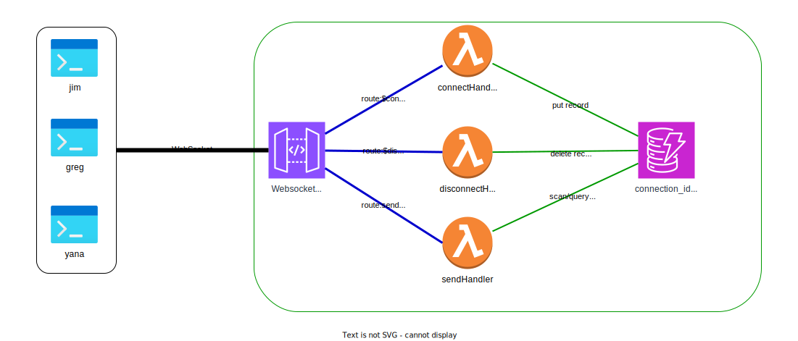

# Websocket Demo

This POC is intended to show how a central SaaS service can manage and
communicate with a fleet of websocket clients (brokers, agents)

https://github.com/user-attachments/assets/c3ab2f05-03c9-48b3-8a10-7690674c9064




## Usage

Run the terraform. It will output the api gateway websocket URL (`ws://something.execute-api....`)

1. Open two terminals
2. Run a websocket client like `wscat` in each one with a unique GET parameter `clientId`
   1. `wscat --no-color -c 'wss://hfytuh7hri.execute-api.us-east-1.amazonaws.com/dev?clientId=jim`
   2. `wscat --no-color -c 'wss://hfytuh7hri.execute-api.us-east-1.amazonaws.com/dev?clientId=bob'`

Now you can send messages with properly formatted JSON

```bash
❯ wscat --no-color -c 'wss://hfytuh7hri.execute-api.us-east-1.amazonaws.com/dev?clientId=bob'
Connected (press CTRL+C to quit)
> {"action": "sendMessage", "target":"jim", "message":"Welcome to Webockets!"}
< Thanks! You too!!
>
```

```bash
❯ wscat --no-color -c 'wss://hfytuh7hri.execute-api.us-east-1.amazonaws.com/dev?clientId=jim'
Connected (press CTRL+C to quit)
< Welcome to Webockets!
> {"action": "sendMessage", "target":"bob", "message":"Thanks! You too!!"}
```
